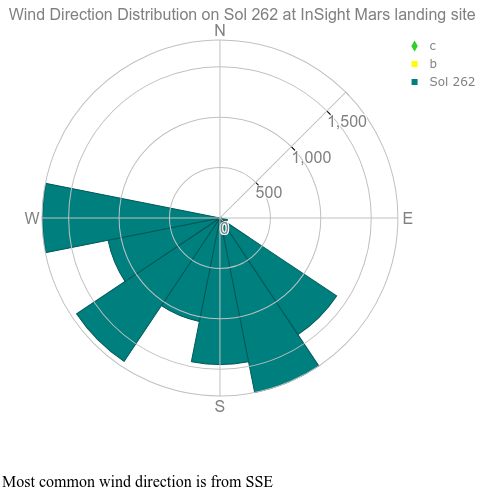

# Nasa APIs
List of **Nasa's APIs** that are going to be used in the project. [API List](https://api.nasa.gov/)

## [APOD](https://apod.nasa.gov/apod/astropix.html)
> Astronomic Picture of the Day

### HTTP Request
`GET https://api.nasa.gov/planetary/apod`

### Query Parameters
<table>
    <tr>
        <th>Parameter</th>
        <th>Type</th>
        <th>Default</th>
        <th>Description</th>
    </tr>
    <tr>
        <td>date</td>
        <td>YYYY-MM-DD</td>
        <td>today</td>
        <td>The date of the APOD image to retrieve</td>
    </tr>
    <tr>
        <td>start_date</td>
        <td>YYYY-MM-DD</td>
        <td>none</td>
        <td>The start of a date range, when requesting date for a range of dates. Cannot be used with date.</td>
    </tr>
    <tr>
        <td>end_date</td>
        <td>YYYY-MM-DD</td>
        <td>today</td>
        <td>The end of the date range, when used with start_date.</td>
    </tr>
    <tr>
        <td>count</td>
        <td>int</td>
        <td>none</td>
        <td>If this is specified then count randomly chosen images will be returned. Cannot be used with date or start_date and end_date.</td>
    </tr>
    <tr>
        <td>thumbs</td>
        <td>bool</td>
        <td>False</td>
        <td>Return the URL of video thumbnail. If an APOD is not a video, this parameter is ignored.</td>
    </tr>
    <tr>
        <td>api_key</td>
        <td>string</td>
        <td>DEMO_KEY</td>
        <td>api.nasa.gov key for expanded usage</td>
    </tr>
</table>

### [Example response](https://api.nasa.gov/planetary/apod?api_key=DEMO_KEY)
```json
{
    "date": "2022-03-19",
    "explanation": "2MASS J17554042+6551277 doesn't exactly roll off the tongue but that's the name, a coordinate-based catalog designation, of the star centered in this sharp field of view. Fans of the distant universe should get used to its spiky appearance though. The diffraction pattern is created by the 18 hexagonal mirror segments of the James Webb Space Telescope. After unfolding, the segments have now been adjusted to achieve a diffraction limited alignment at infrared wavelengths while operating in concert as a single 6.5 meter diameter primary mirror. The resulting image taken by Webb's NIRcam demonstrates their precise alignment is the best physics will allow. 2MASS J17554042+6551277 is about 2,000 light-years away and well within our own galaxy. But the galaxies scattered across the background of the Webb telescope alignment evaluation image are likely billions of light-years distant, far beyond the Milky Way.",
    "hdurl": "https://apod.nasa.gov/apod/image/2203/telescope_alignment_evaluation_image_labeled.jpg",
    "media_type": "image",
    "service_version": "v1",
    "title": "2MASS J17554042+6551277",
    "url": "https://apod.nasa.gov/apod/image/2203/telescope_alignment_evaluation_image_labeled1024.jpg"
}
```

### Documentation
[GitHub](https://github.com/nasa/apod-api)

## [EPIC](https://epic.gsfc.nasa.gov/)
> Earth Polychromatic Imaging Camera

### Example queries
https://epic.gsfc.nasa.gov/api/natural

https://epic.gsfc.nasa.gov/api/enhanced/date/2015-10-31

https://epic.gsfc.nasa.gov/api/natural/all

https://epic.gsfc.nasa.gov/archive/natural/2015/10/31/png/epic_1b_20151031074844.png

### Retrievable metadata
- image [name]
- date
- caption
- centroid_coordinates
- dscovr_j2000_position
- lunar_j2000_position
- sun_j2000_position
- attitude_quaternions
- coords 
    - lat (Latitude)
    - lon (Longitude)
    - centroid_coordinates (Geographical coordinates that the satellite is looking at)
    - dscovr_j2000_position (Position of the satellite in space)
    - lunar_j2000_position   (Position of the moon in space)
    - sun_j2000_position (Position of the sun in space)
    - attitude_quaternions   (Satellite attitude)

### Image locations
<table>
    <tr>
        <th>Site Name</th>
        <th>Archive</th>
        <th>Collection</th>
        <th>Year</th>
        <th>Month</th>
        <th>Day</th>
        <th>Image Type</th>
        <th>File Name</th>
        <!-- 8 headers -->
    </tr>
    <tr>
        <td>https://epic.gsfc.nasa.gov</td>
        <td>archive</td>
        <td>natural</td>
        <td>2016</td>
        <td>10</td>
        <td>31</td>
        <td>png</td>
        <td>epic_1b_20161031xxxx.png</td>
    </tr>
    <tr>
        <td>https://epic.gsfc.nasa.gov</td>
        <td>archive</td>
        <td>natural</td>
        <td>2016</td>
        <td>10</td>
        <td>31</td>
        <td>jpg</td>
        <td>epic_1b_20161031xxxx.jpg</td>
    </tr>
    <tr>
        <td>https://epic.gsfc.nasa.gov</td>
        <td>archive</td>
        <td>natural</td>
        <td>2016</td>
        <td>10</td>
        <td>31</td>
        <td>thumbs</td>
        <td>epic_1b_20161031xxxx.jpg</td>
    </tr>
    <tr>
        <td>https://epic.gsfc.nasa.gov</td>
        <td>archive</td>
        <td>enhanced</td>
        <td>2016</td>
        <td>10</td>
        <td>31</td>
        <td>png</td>
        <td>epic_RGB_20161031xxxx.png</td>
    </tr>
    <tr>
        <td>https://epic.gsfc.nasa.gov</td>
        <td>archive</td>
        <td>enhanced</td>
        <td>2016</td>
        <td>10</td>
        <td>31</td>
        <td>jpg</td>
        <td>epic_RGB_20161031xxxx.jpg</td>
    </tr>
    <tr>
        <td>https://epic.gsfc.nasa.gov</td>
        <td>archive</td>
        <td>enhanced</td>
        <td>2016</td>
        <td>10</td>
        <td>31</td>
        <td>thumbs</td>
        <td>epic_RGB_20161031xxxx.jpg</td>
    </tr>
</table>

## [NASA Image and Video Library](https://images.nasa.gov/)
> API to access the NASA Image and Video Library site at images.nasa.gov

### Available Endpoints
The **images API** contains 4 endpoints `GET https://images-api.nasa.gov`

### Endpoints
<table>
    <tr>
        <th>Endpoint</th>
        <th>Description</th>
    </tr>
    <tr>
        <td>GET /search?q={q}</td>
        <td>Performing a search</td>
    </tr>
    <tr>
        <td>GET /asset/{nasa_id}</td>
        <td>Retrieving a media asset's manifest</td>
    </tr>
    <tr>
        <td>GET /metadata/{nasa_id}</td>
        <td>Retrieving a media asset's metadata location</td>
    </tr>
    <tr>
        <td>GET /captions/{nasa_id}</td>
        <td>Retrieving a video asset's captions location</td>
    </tr>
</table>

## [Insight](https://mars.nasa.gov/insight/weather/)
> Latest Weather at [Elysium Planitia](https://es.wikipedia.org/wiki/Elysium_Planitia), Mars.

### Important Info
- **Latest data**: October 25, 2020
- 1 [Martian Sol](https://en.wikipedia.org/wiki/Sol_(day_on_Mars)) is a day in Mars
    - **24** hours, **39** minutes and **35.244** seconds
- [Documentation](https://api.nasa.gov/assets/insight/InSight%20Weather%20API%20Documentation.pdf)

### HTTP Request
`GET https://api.nasa.gov/insight_weather/?api_key=DEMO_KEY&feedtype=json&ver=1.0`

### Query Parameters
<table>
    <tr>
        <th>Parameter</th>
        <th>Type</th>
        <th>Default</th>
        <th>Description</th>
    </tr>
    <tr>
        <td>version</td>
        <td>float</td>
        <td>1.0</td>
        <td>The version of this API</td>
    </tr>
    <tr>
        <td>feedtype</td>
        <td>string</td>
        <td>json</td>
        <td>The format of what is returned. Currently the default is JSON and only JSON works.</td>
    </tr>
    <tr>
        <td>api_key</td>
        <td>string</td>
        <td>DEMO_KEY</td>
        <td>api.data.gov key for expanded usage</td>
    </tr>
</table>

### Example query
https://api.nasa.gov/insight_weather/?api_key=DEMO_KEY&feedtype=json&ver=1.0

### Images


## [Mars Rover Photos](https://github.com/chrisccerami/mars-photo-api)
> Image data gathered by **NASA**'s Curiosity, Opportunity, and Spirit rovers on Mars

### Rover Cameras
<table>
    <tr>
        <th>Abbreviation</th>
        <th>Camera</th>
        <th>Curiosity</th>
        <th>Opportunity</th>
        <th>Spirit</th>
    </tr>
    <tr>
        <td>FHAZ</td>
        <td>Front Hazard Avoidance Camera</td>
        <td>✔</td>
        <td>✔</td>
        <td>✔</td>
    </tr>
    <tr>
        <td>RHAZ</td>
        <td>Rear Hazard Avoidance Camera</td>
        <td>✔</td>
        <td>✔</td>
        <td>✔</td>
    </tr>
    <tr>
        <td>MAST</td>
        <td>Mast Camera</td>
        <td>✔</td>
        <td> </td>
        <td> </td>
    </tr>
    <tr>
        <td>CHEMCAM</td>
        <td>Chemestry and Camera Complex</td>
        <td>✔</td>
        <td> </td>
        <td> </td>
    </tr>
    <tr>
        <td>MAHLI</td>
        <td>Mars Hand Lens Imager</td>
        <td>✔</td>
        <td> </td>
        <td> </td>
    </tr>
    <tr>
        <td>MARDI</td>
        <td>Mars Descent Imager</td>
        <td>✔</td>
        <td> </td>
        <td> </td>
    </tr>
    <tr>
        <td>NAVCAM</td>
        <td>Navigation Camera</td>
        <td>✔</td>
        <td>✔</td>
        <td>✔</td>
    </tr>
    <tr>
        <td>PANCAM</td>
        <td>Panoramic Camera</td>
        <td> </td>
        <td>✔</td>
        <td>✔</td>
    </tr>
    <tr>
        <td>MINITES</td>
        <td>Miniature Thermal Emission Spectrometer (Mini-TES)</td>
        <td> </td>
        <td>✔</td>
        <td>✔</td>
    </tr>
</table>

### Extra resources
https://mars-photos.herokuapp.com/